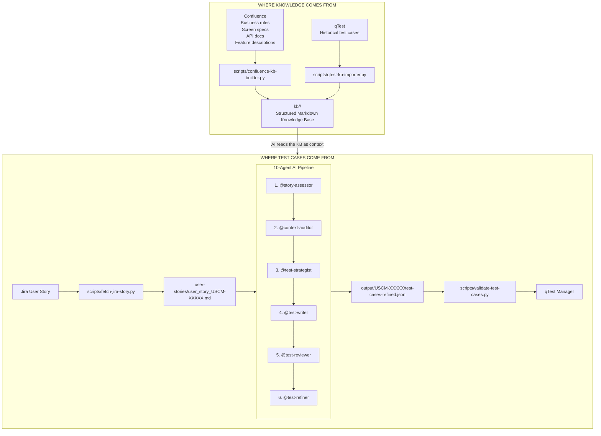

# AI- Test Case Generation System -- Explainer Guide

## Architecture Overview

## 10-Agent AI Pipeline

1. **@story-assessor** -- "Is this story good enough to test?"
2. **@context-auditor** -- "Do we have enough KB docs?"
3. **@test-strategist** -- "What kinds of tests do we need?"
4. **@test-writer** -- Write the actual test cases.
5. **@test-reviewer** -- Punch holes; identify missing cases.
6. **@test-refiner** -- Apply reviewer fixes.
7. **Validate quality**
8. **Import to qTest**

## Data Flow

1. Fetch Jira story (`scripts/fetch-jira-story.py`)
    - Output: `user-stories/user_story_USCM-92511.md`
2. AI reads the Knowledge Base
    - Product module docs
    - Shared rules
    - Test knowledge
    - Business rules
    - API behavior
    - Edge cases
3. Story Quality Gate
    - Story scored out of 100
    - Score \<70 blocks processing
    - Output: `quality_assessment.md`
4. Knowledge Gap Check
    - Coverage report
    - Covered / Partial / Missing
    - Missing docs create Jira tasks
5. Build Test Strategy
    - Happy path
    - Error path
    - Edge cases
    - Boundary value
    - Equivalence
    - Risk areas
    - Output: `strategy.json`
6. Write Test Cases
    - Title
    - Preconditions
    - Steps
    - Expected results
    - Duplicate detection
    - Output: `test-cases.json`
7. Adversarial Review
    - Missing negative tests
    - Vague steps
    - Missing assertions
    - Output: `review-critique.md`
8. Refine & Fix
    - Apply reviewer feedback
    - Output:
        - `test-cases-refined.json`
        - `refinement-diff.md`
9. Validate Quality
    - Completeness
    - Assertiveness
    - Executability
    - Coverage
    - Target: **80/100**
10. Done
    - Import into qTest

## AI Agents

| Agent | Role |
| --- | --- |
| @story-assessor | Quality gate |
| @knowledge-curator | KB builder |
| @qtest-preprocessor | qTest importer |
| @context-auditor | Knowledge gap checker |
| @test-manager | Pipeline orchestration |
| @test-strategist | Test planning |
| @test-writer | Test generation |
| @test-reviewer | Critical review |
| @test-refiner | Apply fixes |
| @feedback-analyst | Pipeline analysis |

## Governance

- AI cannot modify its own governing instructions.
- Proposed changes require human approval.
- Governance prevents silent drift.

## Quality Metrics

Each test case is scored on:
- Completeness
- Assertiveness
- Executability
- Coverage
- Specificity
- Boundary Testing
- Negative Testing
- Non-Duplication

Targets:
- Human approval without edits: **95%**
- Per-test score: **80/100**
- Story quality gate: **70/100**
- Hallucinations: **0**

Governance - How the System Stays Safe
A key concern: *what happens if the AI tries to change its own instructions?*
This system uses a *"report-first" governance model*:

AI proposes a change to an agent instruction file, then governance-check-py runs, Generates a report: "Here is what changed and why" and Human reviewer reads it
- The AI can *suggest* - it cannot «*self-modify its own core rules.
- governance/protected-paths.json lists every file that requires human approval to change.
- This prevents "silent drift" - where the AI gradually rewrites its own behavior without anyone noticing.

|Metric | Target |
-------.-------
|Test cases passing human A review without changes | ≥ 95% |
|Per-TC validation score | ≥ 80 / 100 |
|Story quality gate (minimum to proceed) | ≥ 70 / 100 |
|Hallucinations (AI making de rules not in KB) | 0 |
## Quick Start

1.  prompt as ,Generate the TC for user stoty -xxxx
