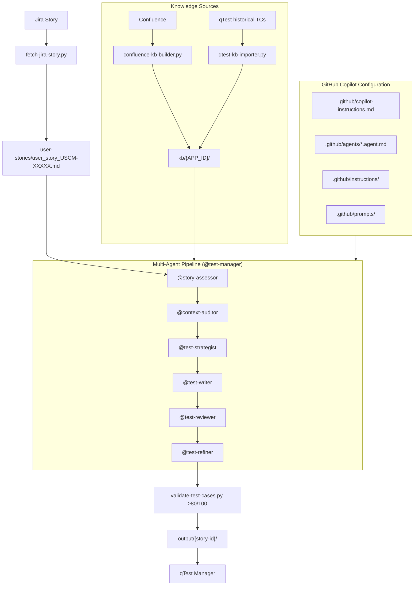
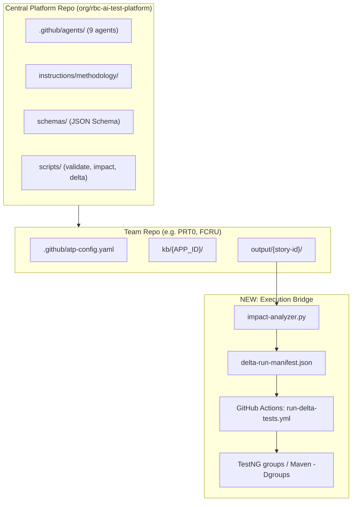

# RBC AI Test Design Platform (ATP) — Enterprise Assessment & Proposed Standard

> **Purpose:** Reference document for architecture review, gap analysis, and enterprise adoption planning.  
> **Scope:** QE Agent Test Lab (`i1n0-uscm-qe-agent-test-lab`), GitHub Copilot multi-agent pipeline, and downstream execution repos (PRT0, FCRU).  
> **Last updated:** June 2026

---

## Table of Contents

1. [Executive Summary](#1-executive-summary)
2. [System Context](#2-system-context)
3. [Architecture Overview](#3-architecture-overview)
4. [Agent Reference](#4-agent-reference)
5. [Pipeline Phases & Artifacts](#5-pipeline-phases--artifacts)
6. [Knowledge Base Setup](#6-knowledge-base-setup)
7. [Final Pros and Cons](#7-final-pros-and-cons)
8. [Gap Analysis](#8-gap-analysis)
9. [Proposed Enterprise Standard](#9-proposed-enterprise-standard)
10. [Solutions by Priority Area](#10-solutions-by-priority-area)
11. [Enterprise Adoption Model](#11-enterprise-adoption-model)
12. [Phased Roadmap](#12-phased-roadmap)
13. [Success Metrics](#13-success-metrics)
14. [Configuration & How to Run](#14-configuration--how-to-run)
15. [Immediate Next Steps](#15-immediate-next-steps)
16. [Appendix: Example Artifacts](#16-appendix-example-artifacts)

---

## 1. Executive Summary

The **AI Test Design System** is a GitHub Copilot–based, multi-agent pipeline for generating KB-grounded manual test cases from Jira user stories. It is a **solid, enterprise-appropriate foundation** for regulated environments like RBC.

**Recommendation:** Keep the current approach and **extend** it with:

- A **central platform repo** (single source for agents, methodology, schemas)
- **Context budget & pipeline modes** (reduce token cost)
- **Strict grounding enforcement** (close hallucination gaps)
- **Test Impact Analysis (TIA) + delta-run-manifest** (bridge design to execution)
- **Tiered TCs + TestNG groups** (shorter, targeted test runs)

This transforms the test lab from a **TC design tool** into an **enterprise test intelligence platform** that other teams can adopt via configuration, not custom agent development.

---

## 2. System Context

### Two Related but Different Systems

| Layer | Repo / Location | Purpose |
|-------|-----------------|---------|
| **Test case design (AI pipeline)** | `i1n0-uscm-qe-agent-test-lab` | Generate manual test cases from Jira stories using KB + multi-agent Copilot pipeline |
| **Test execution (Java automation)** | `chu0-EntityStructure`, `PRT0`, etc. | Run REST Assured / Kafka tests, Allure reports, qTest execution |

### Onboarding Repo

This document lives in `Onboarding_test_automation_rbc`, which **documents and explains** the system. The actual agent files, KB, and scripts reside in the QE test lab repo.

### Product-Repo Agent (`qa-story`)

Separate from the QE test lab, product repos may use a `qa-story` agent that extends the flow:

1. Story analysis
2. Test case design
3. Push to qTest
4. Generate Java automation
5. HTML report (Allure)

That is **execution automation**, not test case design.

---

## 3. Architecture Overview

### High-Level Flow



### Core Design Principles

1. **Configuration as code** — Agents, methodology, and patterns live in version-controlled Markdown under `.github/`.
2. **KB-grounded generation** — Agents read `kb/{APP_ID}/` only; no cross-app KB leakage.
3. **Specialist agents + orchestrator** — `@test-manager` sequences phases; each specialist has a narrow role.
4. **Deterministic gates** — Python scripts enforce quality (story ≥70, TCs ≥80/100).
5. **Human-in-the-loop** — Low-quality stories need override; governance blocks agents from editing their own instructions.
6. **File-based state** — Artifacts in `output/{story-id}/` make the pipeline inspectable and replayable.

### Repository Layout (QE Test Lab)

```
i1n0-uscm-qe-agent-test-lab/
├── .github/
│   ├── copilot-instructions.md      # Global Copilot context
│   ├── agents/                      # Specialist agents
│   │   ├── test-manager.agent.md    # Orchestrator
│   │   ├── story-assessor.agent.md
│   │   ├── context-auditor.agent.md
│   │   ├── test-strategist.agent.md
│   │   ├── test-writer.agent.md
│   │   ├── test-reviewer.agent.md
│   │   ├── test-refiner.agent.md
│   │   ├── knowledge-curator.agent.md
│   │   ├── qtest-preprocessor.agent.md
│   │   └── feedback-analyst.agent.md
│   ├── instructions/
│   │   ├── methodology/             # 6-step test design process
│   │   ├── templates/               # KB document templates
│   │   └── test-patterns/           # gold-standard + anti-patterns per layer
│   └── prompts/                     # Slash commands
├── kb/
│   ├── apps-registry.md
│   └── {APP_ID}/                    # Per-app knowledge base
├── scripts/                         # Python automation
├── output/{story-id}/               # Pipeline artifacts
└── docs/                            # Architecture, KB setup, governance
```

### Enhanced Architecture (Proposed)



---

## 4. Agent Reference

### 9 Specialist Agents + Orchestrator

| Agent | Phase | Role | Key Output |
|-------|-------|------|------------|
| `@test-manager` | All | Orchestrates full pipeline; does NOT write/review/refine | All artifacts in `output/{story-id}/` |
| `@story-assessor` | P1 | Story quality gate (0–100 score) | `{StoryID}_quality_assessment.md` |
| `@context-auditor` | P2 | KB coverage audit; documents gaps, does not stop pipeline | `coverage-report.json` |
| `@test-strategist` | P3 | Decides *what* to test; selects ISTQB techniques | `strategy.json` |
| `@test-writer` | P4 | Expands scenarios into full TCs; KB-grounded | `test-cases.json` |
| `@test-reviewer` | P5 | Adversarial 10-dimension critique; never fixes | `review-critique.md` |
| `@test-refiner` | P6 | Surgical fixes only; never regenerates from scratch | `test-cases-refined.json`, `refinement-diff.md` |
| `@knowledge-curator` | Setup | Builds/maintains KB from Confluence, qTest (4 passes) | `kb/{APP_ID}/modules/`, `index.md` |
| `@qtest-preprocessor` | Setup | Quality gate for qTest imports; semantic tagging | Preprocessed staging files |
| `@feedback-analyst` | On-demand | Post-pipeline systemic analysis | `improvement-report.md` |

### Agent Details

#### @test-manager (Orchestrator)

- Reads each specialist agent file and follows its workflow sequentially.
- Passes output files from one phase as input to the next.
- Enforces gate logic (Phase 1 fail → ask user for override).
- Tracks progress; reports failures without silent retries.
- Presents final summary and optional HTML report.
- **Does NOT** write, review, or refine content itself.

#### @story-assessor (Phase 1 — Quality Gate)

**Scoring rubric (100 points):**

| Criterion | Points |
|-----------|--------|
| Acceptance Criteria Quality | 30 |
| Testable Scenarios | 25 |
| Technical Specification | 20 |
| Business Rules & Logic | 15 |
| Completeness Indicators | 10 |

- **PASS:** score ≥ 70 → continue automatically
- **FAIL:** score < 70 → push assessment to Jira, ask user for override; if "No" → stop

#### @context-auditor (Phase 2 — Coverage Audit)

Audits 8 dimensions:

1. Feature spec
2. Field rules
3. Error handling
4. Business rules
5. Roles
6. State transitions
7. Integrations
8. Boundaries

Assigns per dimension: **COVERED / PARTIAL / MISSING**  
Sets confidence: **HIGH / MEDIUM / LOW**  
Maps acceptance criteria to KB documents.

#### @test-strategist (Phase 3 — Strategy)

- Classifies layer: API, UI, Data, Integration
- Extracts testable requirements from ACs only
- Selects techniques: EP, BVA, Decision Table, State Transition, Error Guessing
- Generates up to 20 test scenarios with risk assessment
- Builds Requirements × Coverage Type matrix
- Cross-references existing regression tests

#### @test-writer (Phase 4 — Write TCs)

- Loads KB context per scenario; references `kb/attachments/` diagrams
- Writes preconditions, steps, expected results
- Applies 7 TC Craft Rules
- Runs 10-point quality checklist (assertion density ≥ 60%)
- Marks unknown values as `[ASSUMED - VERIFY]`
- Validates via script (score ≥ 80/100)
- Checks `test-suite-index.md` for duplicates

#### @test-reviewer (Phase 5 — Adversarial Review)

10-dimension critique:

1. Grounding (hallucinated values)
2. Coverage gaps
3. Assertion strength
4. Executability
5. Deduplication
6. Edge cases (concurrency, timeouts)
7. Security (auth bypass, injection)
8. Negative paths
9. Vague pass/fail criteria
10. Missing preconditions

Classifies issues: **Critical / Major / Minor**  
**Never fixes** — only critiques.

#### @test-refiner (Phase 6 — Refinement)

- Parses critiques in priority order: Critical → Major → Minor
- Rewrites vague assertions with concrete values
- Expands missing preconditions; fixes KB references
- **Does NOT modify unflagged steps**
- Generates new TCs for missing scenarios
- Runs deduplication check and re-validation (≥ 80/100)
- Marks each TC: **MODIFIED / ADDED / UNCHANGED**

#### @knowledge-curator (KB Setup)

| Pass | Action | Output |
|------|--------|--------|
| Pass 1 | Classify & extract entities per module | `kb/modules/` populated |
| Pass 2 | Cross-reference, build index, detect gaps | `index.md`, related docs |
| Pass 3 | Seed test knowledge (risk, failure patterns) | `test-knowledge/` per module |
| Pass 4 | Index qTest TCs, enrich defect patterns | `test-history/`, `test-suite-index.md` |

#### @feedback-analyst (On-Demand)

- Reads all pipeline artifacts (read-only)
- Identifies recurring patterns across phases
- Root cause classification: `KB_GAP`, `INSTRUCTION_GAP`, `PATTERN_GAP`, `STORY_QUALITY_GAP`
- Evaluates user feedback: `ACCEPTED`, `NOTED`, `REJECTED`
- Generates improvement proposals; flags governance-protected files

---

## 5. Pipeline Phases & Artifacts

### 7-Phase Pipeline

| Phase | Name | Agent | Output |
|-------|------|-------|--------|
| P0 | Resolve App KB Root | `@test-manager` | Sets `KB_ROOT = kb/{APP_ID}/` |
| P1 | Story Quality Gate | `@story-assessor` | `{StoryID}_quality_assessment.md` |
| P2 | Coverage Audit | `@context-auditor` | `coverage-report.json` |
| P3 | Test Strategy | `@test-strategist` | `strategy.json` |
| P4 | Write TCs | `@test-writer` | `test-cases.json` |
| P5 | Adversarial Review | `@test-reviewer` | `review-critique.md` |
| P6 | Refinement | `@test-refiner` | `test-cases-refined.json`, `refinement-diff.md` |
| P7 | Report (optional) | Script | HTML report via `generate-report.py` |

### Validation (Post-P6)

```bash
python scripts/validate-test-cases.py output/{story-id}/test-cases-refined.json
```

- 8-dimension rubric
- Target: **≥ 80/100** per test case
- Outputs: `validation-report.json`

### Complete Artifact Set (per story)

Example: `output/USCM-97070/`

| File | Description |
|------|-------------|
| `USCM-97070_quality_assessment.md` | Story quality score and recommendations |
| `coverage-report.json` | KB coverage per dimension, confidence level |
| `strategy.json` | Scenarios, techniques, requirements matrix |
| `test-cases.json` | Initial generated test cases |
| `review-critique.md` | Adversarial review findings |
| `test-cases-refined.json` | Final deliverable |
| `refinement-diff.md` | MODIFIED / ADDED / UNCHANGED changelog |
| `validation-report.json` | Per-TC quality scores |

### Quality Gates Summary

| Gate | Threshold | Action on Fail |
|------|-----------|----------------|
| Story quality | ≥ 70/100 | Block; user override to continue |
| TC quality (per TC) | ≥ 80/100 | Re-run refiner or fix KB |
| Hallucinations | 0 unflagged | Block in strict mode |
| Duplicates | 0 vs qTest history | Flag in review; dedup in refiner |

---

## 6. Knowledge Base Setup

### Step 1 of 2: Knowledge Base Setup (before any TC generation)

> Load the AI's memory with domain knowledge and historical test cases before generating anything.

### Pipeline A — Confluence Documents

| Step | Action | Output |
|------|--------|--------|
| 1 | Copy `_template.json` → `scripts/kb-source-configs/{APP_ID}.json` | App config |
| 2 | `python scripts/confluence-kb-builder.py` | `kb-sources/{APP_ID}/raw/` |
| 3 | `@knowledge-curator` Pass 1 | Classify, extract entities, copy diagrams |
| 4 | `@knowledge-curator` Pass 2 | Cross-reference, build index, flag gaps |
| 5 | `@knowledge-curator` Pass 3 (optional) | Risk areas, failure patterns |

### Pipeline B — qTest Historical TCs

| Step | Action | Output |
|------|--------|--------|
| 1 | Export qTest as `.xlsx` → `kb-sources/{APP_ID}/qtest/raw/` | Raw export |
| 2 | `python scripts/qtest-csv-to-kb-source.py` | Staging `.md` files |
| 3 | `@qtest-preprocessor` | Validate, normalize, tag (layer/risk/behavior) |
| 4 | `@knowledge-curator` Pass 4 | Index TCs, cross-ref KB, enrich defect patterns |

### KB Structure

```
kb/{APP_ID}/
├── index.md
├── test-suite-index.md
├── modules/
│   └── {module}/
│       ├── module-overview.md
│       ├── entities (APIs, rules, etc.)
│       └── ...
├── test-knowledge/
│   └── defect-patterns, risk areas, boundary hotspots
├── test-history/
│   └── historical TC data for prioritization
└── attachments/
    └── architecture diagrams
```

### KB Conventions

- Each app isolated at `kb/{APP_ID}/`
- Module-first: `kb/{APP_ID}/modules/{module}/`
- YAML frontmatter: `module`, `type`, `entities`, `related`, `last_updated`
- Agents **NEVER** read from a different app's KB folder
- App registry: `kb/apps-registry.md`

---

## 7. Final Pros and Cons

### Pros

| Area | Strength |
|------|----------|
| **Architecture** | Clear separation: KB curation → quality gates → strategy → write → review → refine → validate |
| **Grounding** | `kb_sources` per TC, `[ASSUMED - VERIFY]`, anti-patterns/gold-standards per layer |
| **Traceability** | Full artifact chain; auditable for regulated environments |
| **Quality gates** | Story ≥70, TC ≥80/100, 8-dimension rubric — measurable |
| **Deduplication** | `test-suite-index.md` + `test-history/` prevents regenerating existing qTest TCs |
| **Governance** | Protected paths, report-first changes, `@feedback-analyst` for systemic improvement |
| **Multi-app** | `kb/{APP_ID}/` isolation scales across PRT0, FCRU, etc. |
| **TC structure** | Rich JSON (layer, technique, risk_score, executability, requirement_ids) |
| **Human-in-the-loop** | Override for low-quality stories; refinement-diff shows change rationale |
| **ISTQB alignment** | EP, BVA, Decision Tables, State Transition, Error Guessing |

### Cons

| Area | Weakness |
|------|----------|
| **Cost / tokens** | 6–7 agent phases per story; KB read repeatedly; 4-pass KB curation; review+refine doubles cost |
| **Hallucinations** | `kb_confidence: MEDIUM` + `low_quality_override: true` still proceeds |
| **Large test cases** | Verbose JSON; no tiering (smoke vs full); strategy capped at ~20 scenarios |
| **Execution duration** | Design pipeline ≠ execution; no bridge to delta TestNG runs |
| **Delta / impact** | `refinement-diff` tracks TC changes but no change-impact → test selection for CI |
| **Operational** | Chat-invoked, not headless CI; manual KB maintenance |
| **Two-repo confusion** | Test lab vs product repo (`qa-story`) |
| **Iteration cost** | `-modify-close` artifact variants suggest manual rework cycles |

---

## 8. Gap Analysis

### A. Cost & Token Usage

**Current behavior (estimated):**

```
KB Curation:  4 passes × full doc set     ≈ 40–60% of lifetime tokens
Per Story:    7 agents × KB context load  ≈ 50K–150K tokens/story
Review+Refine: ~2× write phase tokens
No reuse:     Same KB modules re-read every story
```

**Gaps:**

- No scoped retrieval (agents read hardcoded paths, not only relevant modules)
- No context caching between phases
- No "quick mode" for low-risk stories
- KB curation is batch-only, not incremental

**Target:** 40–50% token reduction per story.

---

### B. Hallucinations

**Current controls:**

- KB-only assertions, `kb_sources`, grounding audit in `@test-reviewer`, validation script

**Gaps:**

- Pipeline continues at MEDIUM confidence and with `low_quality_override`
- No automated KB lookup verification (e.g., "does `dacaFlag=BD` exist in KB?")
- `[ASSUMED - VERIFY]` is manual follow-up, not a blocking gate
- No confidence decay when KB is stale

**Target:** Zero unflagged hallucinations in production TCs.

---

### C. Large Test Cases

**Current behavior:**

- Full expansion: preconditions + multi-step actions + expected results per TC
- 15 TCs for one story (USCM-97070) is reasonable; complex stories can grow quickly

**Gaps:**

- No TC tiering (P0 smoke / P1 functional / P2 edge)
- No "minimum viable suite" for sprint validation
- No step-count or assertion-density caps per TC
- Duplicate functional coverage across stories not consolidated at portfolio level

---

### D. Shorter Test Execution Duration

**Current state:**

- Pipeline produces **manual TC design** only
- PRT0: `./mvnw test -Dtest=YourNewTest` is per-class, not story-driven
- No standard mapping: `story-id` → `TestNG groups/tags` → minimal run set
- PRT0 full regression: 60+ test classes across 25+ domains

**Gap:** Missing **Test Impact Analysis (TIA)** layer between `strategy.json` and Maven/TestNG.

---

### E. Delta Changes & Applicable Suite Only

**What exists:**

- `strategy.json`: cross-references existing regression
- `refinement-diff.md`: MODIFIED / ADDED / UNCHANGED
- `test-history/`: historical TC index

**What is missing:**

- No **change-impact graph**: `git diff / Jira story` → affected modules → affected TCs → affected TestNG classes
- No **delta execution manifest** for CI
- No integration with GitHub Actions "run only impacted workflows"

---

## 9. Proposed Enterprise Standard

### Name: RBC AI Test Design Platform (ATP)

A standard other teams adopt without re-building the pipeline from scratch.

### Core Standard Components

| Component | Purpose | Adoption |
|-----------|---------|----------|
| **ATP Config** (`atp-config.yaml`) | App ID, Jira project, qTest project, TestNG suite mapping, token budgets | Each team adds one file |
| **Central Agent Repo** | Single source for agents, methodology, schemas | Teams reference via submodule or Copilot path |
| **KB Schema Standard** | YAML frontmatter, module layout, `test-suite-index.md` format | Mandatory for all apps |
| **Artifact Schema** | `test-cases-refined.json` v2 with `impact_tags`, `test_tier`, `automation_ref` | Versioned JSON Schema |
| **Pipeline Modes** | `FULL` / `STANDARD` / `DELTA` / `QUICK` | Per-invocation flag |
| **Impact Analyzer** | Story + git diff → minimal TC + TestNG set | Shared script |
| **Delta CI Workflow** | Runs only `delta-run-manifest.json` tests | Reusable GHA workflow |
| **Governance** | Protected paths, `governance-check.py`, feedback loop | Unchanged, central |

### Pipeline Modes

| Mode | Phases Run | Use Case |
|------|------------|----------|
| **FULL** | P1–P7 + review + refine | New feature, high risk |
| **STANDARD** | P1–P6 (default) | Normal sprint stories |
| **DELTA** | Skip strategy if exists; focus on changed modules | Story update, minor change |
| **QUICK** | P1–P4 only; skip review+refine | Low-risk, KB confidence HIGH |

Invocation example:

```
@test-manager PRT0 USCM-97070 --mode=QUICK
```

---

## 10. Solutions by Priority Area

### 10.1 Cost & Token Usage — Context Budget Standard

| Control | Implementation |
|---------|----------------|
| **Scoped KB retrieval** | After Phase 2, only load modules in `coverage-report.json` → `relevant_modules[]` |
| **Phase caching** | Write `output/{story-id}/.context-cache.json` after Phase 2; Phases 3–6 read cache |
| **Pipeline modes** | `QUICK` skips review+refine; `DELTA` skips strategy if `strategy.json` exists |
| **Token budget** | `atp-config.yaml`: `max_tokens_per_story: 80000`; agent stops and reports if exceeded |
| **Incremental KB** | `confluence-kb-builder.py --incremental`; only changed pages re-curated |
| **Batch stories** | Process sprint stories in one run with shared KB context |

---

### 10.2 Hallucinations — Grounding Enforcement Standard

| Control | Implementation |
|---------|----------------|
| **Hard block on assumptions** | `validate-test-cases.py --strict`: any `[ASSUMED - VERIFY]` → FAIL unless `--allow-assumptions` |
| **KB confidence gate** | LOW → block Phase 4; MEDIUM → require human ack in chat |
| **Automated grounding check** | New `verify-kb-grounding.py`: extract field names/values from TCs, grep KB, report unmatched |
| **KB freshness** | `kb_confidence` derived from `last_updated` in frontmatter; stale >90 days → downgrade |
| **Reviewer grounding audit** | `@test-reviewer` must output `grounding_failures[]` with KB path or "NOT IN KB" |
| **No override for CRITICAL** | `low_quality_override` allowed for story gate only, not grounding failures |

---

### 10.3 Large Test Cases — Tiered TC Standard

Extend `test-cases-refined.json`:

```json
{
  "test_tier": "P0",
  "execution_scope": "smoke",
  "max_steps": 8,
  "automation_ready": true
}
```

| Tier | When | Max TCs/story |
|------|------|---------------|
| **P0** | Sprint entry, smoke | 3–5 |
| **P1** | Full functional | 10–15 |
| **P2** | Edge, negative, security | As needed |

- `@test-strategist` assigns tier per scenario
- `@test-writer` enforces `max_steps` per tier
- Sprint validation runs P0 only; full regression runs P0+P1+P2

---

### 10.4 Shorter Execution — Test Impact Analysis (TIA) Bridge

**New artifact:** `delta-run-manifest.json`

```json
{
  "story_id": "USCM-97070",
  "trigger": "jira_story",
  "affected_modules": ["account-status-change-adapter"],
  "affected_test_classes": [
    "api.tests.PRT0.AccountLinkDelinkTest"
  ],
  "testng_groups": ["USCM-97070", "account-linkage"],
  "qtest_tc_ids": ["TC-18825", "TC-18826"],
  "run_mode": "delta",
  "estimated_duration_min": 12
}
```

**Flow:**

1. `impact-analyzer.py` reads `strategy.json` + `coverage-report.json` + team's `test-class-map.yaml`
2. Maps modules → existing TestNG classes / qTest folders
3. CI runs: `./mvnw test -Dgroups=USCM-97070 -Denv=qat` instead of full suite

**Team config** (`test-class-map.yaml`):

```yaml
modules:
  account-status-change-adapter:
    test_classes:
      - AccountLinkDelinkTest
      - FeemEventProcessingTest
    qtest_folder: "PRT0/Account Linkage"
```

---

### 10.5 Delta-Only Execution — Change-Based Test Selection

| Input | Output |
|-------|--------|
| Jira story + linked PR/files | `affected_modules[]` |
| `git diff` on PR | `affected_files[]` → modules via code ownership map |
| `strategy.json` `existing_regression_overlap` | TCs to **re-run** vs **skip** |
| `refinement-diff.md` MODIFIED/ADDED | New TCs to run; UNCHANGED → skip |

**Execution modes:**

| Mode | When | What runs |
|------|------|-----------|
| **DELTA** | Story/PR validation | P0 + story-tagged tests only |
| **MODULE** | Module change | All TCs for affected module |
| **FULL** | Release / nightly | Full regression |

**CI integration (reusable workflow):**

```yaml
# .github/workflows/run-delta-tests.yml (central)
on:
  workflow_call:
    inputs:
      story_id:
        required: true
      app_id:
        required: true
jobs:
  impact:
    runs: python scripts/impact-analyzer.py --story ${{ inputs.story_id }}
  test:
    needs: impact
    runs: ./mvnw test -Dgroups=${{ needs.impact.outputs.testng_groups }}
```

---

### 10.6 ATP Config Schema (Proposed)

```yaml
# .github/atp-config.yaml
app_id: PRT0
jira_project: USCM
qtest_project_id: "12345"
kb_root: kb/PRT0/

pipeline:
  default_mode: STANDARD
  max_tokens_per_story: 80000
  strict_grounding: true
  allow_assumptions: false

quality_gates:
  story_min_score: 70
  tc_min_score: 80
  kb_confidence_block: LOW

execution:
  test_class_map: test-class-map.yaml
  default_env: qat
  delta_ci_workflow: org/rbc-ai-test-platform/.github/workflows/run-delta-tests.yml@v1

integrations:
  jira_base_url: https://jira.example.com
  qtest_base_url: https://qtest.example.com
```

---

## 11. Enterprise Adoption Model

### Tier 1: Platform Team

- Maintain agents, schemas, scripts, governance
- Publish `org/rbc-ai-test-platform`
- Run `@feedback-analyst` monthly; propose instruction updates via governance

### Tier 2: Application Teams (PRT0, FCRU, etc.)

1. Add `atp-config.yaml` and `test-class-map.yaml`
2. Run KB setup (Pipeline A + B) once per app
3. Use `@test-manager {APP_ID} {STORY-ID}` for TC design
4. Wire `run-delta-tests.yml` into their CI
5. Keep Java automation in product repo; link via `automation_ref` in TC JSON

### Tier 3: QE / SMEs

- Curate KB via `@knowledge-curator`
- Review `refinement-diff.md` and `validation-report.json`
- Approve `[ASSUMED - VERIFY]` items or fix KB

### Standard Onboarding Checklist (per team)

| Step | Action | Owner |
|------|--------|-------|
| 1 | Register app in `kb/apps-registry.md` | Platform |
| 2 | Configure Confluence + qTest import | Team |
| 3 | Run `@knowledge-curator` Pass 1–4 | Team + SME |
| 4 | Add `atp-config.yaml`, `test-class-map.yaml` | Team |
| 5 | Configure Copilot agent paths (`.github/agents`) | Team |
| 6 | Pilot 3 stories with `@test-manager` | Team |
| 7 | Enable delta CI workflow | DevOps |
| 8 | Measure: tokens/story, TC approval rate, delta run time | Platform |

---

## 12. Phased Roadmap

| Phase | Focus | Deliverables | Timeline |
|-------|--------|--------------|----------|
| **Phase 1** | Standardize & reduce cost | Central repo, `atp-config.yaml`, context cache, pipeline modes | 4–6 weeks |
| **Phase 2** | Grounding & quality | `verify-kb-grounding.py`, strict validation, confidence gates | 4 weeks |
| **Phase 3** | Execution bridge | `impact-analyzer.py`, `delta-run-manifest.json`, `test-class-map.yaml` | 6–8 weeks |
| **Phase 4** | CI integration | Reusable `run-delta-tests.yml`, TestNG groups, qTest delta upload | 4 weeks |
| **Phase 5** | Portfolio optimization | TC tiering, cross-story dedup, token dashboards | Ongoing |

---

## 13. Success Metrics

| Metric | Current (est.) | Target |
|--------|----------------|--------|
| Tokens per story | 80K–150K | < 50K |
| TC approval without edits | ~85% | ≥ 95% |
| Unflagged hallucinations | Unknown | 0 |
| Story → runnable tests (delta) | N/A (full regression) | < 15 min |
| KB curation (incremental) | Full batch | < 10% tokens on update |
| Teams onboarded | 1 (PRT0 pilot) | 5+ in 12 months |

### Per-TC Quality Dimensions (8-dimension rubric)

1. Completeness
2. Assertiveness
3. Executability
4. Coverage
5. Specificity
6. Boundary Testing
7. Negative Testing
8. Non-Duplication

---

## 14. Configuration & How to Run

### Configure GitHub Copilot Agents

1. **Settings → Tools → GitHub Copilot → Customizations → Agents**
2. Enable paths:
   - `.github/agents`
   - Optionally `~/.copilot/agents`
3. Open QE test lab repo as workspace
4. Copilot auto-loads `.github/copilot-instructions.md`

### KB Setup (one-time per app)

```bash
# 1. Register app in kb/apps-registry.md

# 2. Build KB from Confluence
python scripts/confluence-kb-builder.py --app PRT0

# 3. Import historical qTest cases
python scripts/qtest-kb-importer.py --app PRT0

# 4. Curate with agent (Copilot Chat, Agent mode)
@knowledge-curator PRT0
```

### Run Full Pipeline

```
@test-manager PRT0 USCM-97070
```

### Run Individual Phases

```
@story-assessor PRT0 USCM-97070
@context-auditor PRT0 USCM-97070
@test-strategist PRT0 USCM-97070
@test-writer PRT0 USCM-97070
@test-reviewer PRT0 USCM-97070
@test-refiner PRT0 USCM-97070
```

### Slash Commands

| Command | Action |
|---------|--------|
| `generate-test-design` | Full pipeline: assess → audit → strategy → write → review → refine |
| `assess-story` | Story quality check only |
| `audit-coverage` | KB readiness for a story |
| `design-test-strategy` | Strategy generation |
| `write-test-cases` | Expand strategy to TCs |
| `review-test-cases` | Adversarial review |
| `refine-test-cases` | Apply review fixes |
| `analyze-feedback` | Post-pipeline improvement analysis |

### Post-Generation Validation

```bash
python scripts/validate-test-cases.py output/USCM-97070/test-cases-refined.json
python scripts/generate-report.py --story USCM-97070
```

### Downstream: Java Automation (product repo)

```
Run qa-story agent for USCM-XXXXX
```

Phases: Story analysis → TC design → Push to qTest → Generate Java → Allure report

```bash
./mvnw test -Dtest=YourNewTest -Denv=qat
./mvnw allure:serve
```

---

## 15. Immediate Next Steps

1. **Define** `atp-config.yaml` and `test-class-map.yaml` schemas for PRT0
2. **Implement** `impact-analyzer.py` (inputs: `strategy.json`, `coverage-report.json`, team map)
3. **Add** `--mode=QUICK|DELTA|FULL` to `@test-manager` agent instructions
4. **Pilot** USCM-97070: generate `delta-run-manifest.json` and run `./mvnw test -Dgroups=USCM-97070`
5. **Publish** enterprise ATP onboarding doc (extend `AI_Powered_Test_Case_Generation_System_Explainer.md`)
6. **Implement** `verify-kb-grounding.py` for automated hallucination detection
7. **Add** TC tiering fields to `test-cases-refined.json` schema

---

## 16. Appendix: Example Artifacts

### test-cases-refined.json (metadata excerpt — USCM-97070)

```json
{
  "metadata": {
    "story_id": "USCM-97070",
    "scope": "Account link/delink, unified inquiry, transaction approval, utilization",
    "generation_date": "2026-06-12",
    "low_quality_override": true,
    "kb_confidence": "MEDIUM",
    "total_test_cases": 15
  }
}
```

### Single Test Case Structure

```json
{
  "test_id": "TC-001",
  "scenario_id": "SCEN-001",
  "requirement_ids": ["REQ-001"],
  "title": "Delink executes on BD flag when all validations pass",
  "priority": "HIGH",
  "risk_score": "HIGHxMEDIUM",
  "coverage_type": "positive",
  "layer": "Integration",
  "test_type": "functional",
  "technique": "DecisionTable",
  "preconditions": [
    "Kafka topic reachable",
    "Cache state initialized",
    "customerLinkStatus=Open (baseline inquiry)"
  ],
  "steps": [
    {
      "step": 1,
      "action": "Send FEEM event with cifId, accountId, dacaFlag=BD",
      "expected": "Event accepted"
    },
    {
      "step": 2,
      "action": "Invoke trace collection for accountLinkageService.delinkAccount",
      "expected": "Trace captured"
    },
    {
      "step": 3,
      "action": "Query linkage state",
      "expected": "Status=Closed; audit log recorded"
    }
  ],
  "kb_sources": [
    "kb/PRT0/modules/account-status-change-adapter/feem-event-processing-feature.md"
  ],
  "executability": "READY"
}
```

### Governance — Protected Paths

AI cannot autonomously modify:

- `.github/agents/`
- `.github/prompts/`
- `.github/instructions/`
- `.github/copilot-instructions.md`

Changes require:

1. AI proposes change
2. `python scripts/governance-check.py` generates report
3. Human reviewer approves/rejects
4. Reports saved to `output/governance/`

### Scripts Reference

| Script | Purpose |
|--------|---------|
| `fetch-jira-story.py` | Fetch Jira stories; push quality assessments back |
| `confluence-kb-builder.py` | Fetch Confluence pages to `kb-sources/` |
| `qtest-csv-to-kb-source.py` | Convert qTest exports to staging markdown |
| `qtest-kb-importer.py` | Import qTest TCs into KB (Pass 4) |
| `qtest-preprocessor.py` | Enrich qTest staging with semantic metadata |
| `validate-test-cases.py` | 8-dimension quality scoring (≥80/100) |
| `generate-report.py` | Interactive HTML report from pipeline artifacts |
| `governance-check.py` | Enforce protected path governance |

---

## Related Documents

- [AI_Powered_Test_Case_Generation_System_Explainer.md](./AI_Powered_Test_Case_Generation_System_Explainer.md) — System overview and quick start
- [PRT0_Functional_Regression_Guide.md](./PRT0_Functional_Regression_Guide.md) — PRT0 execution framework and qa-story flow
- [Entity_Structure_Test_Automation_Onboarding.md](./Entity_Structure_Test_Automation_Onboarding.md) — FCRU/chu0 automation onboarding
- [goal.md](./goal.md) — End-to-end qa-story agent workflow

---

*Document generated for internal review. Royal Bank of Canada — AI Test Design System.*
