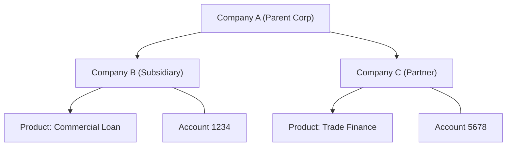
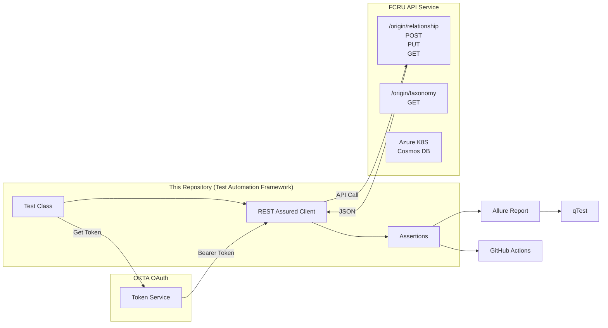
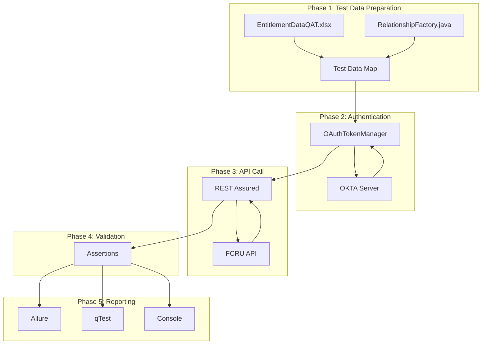
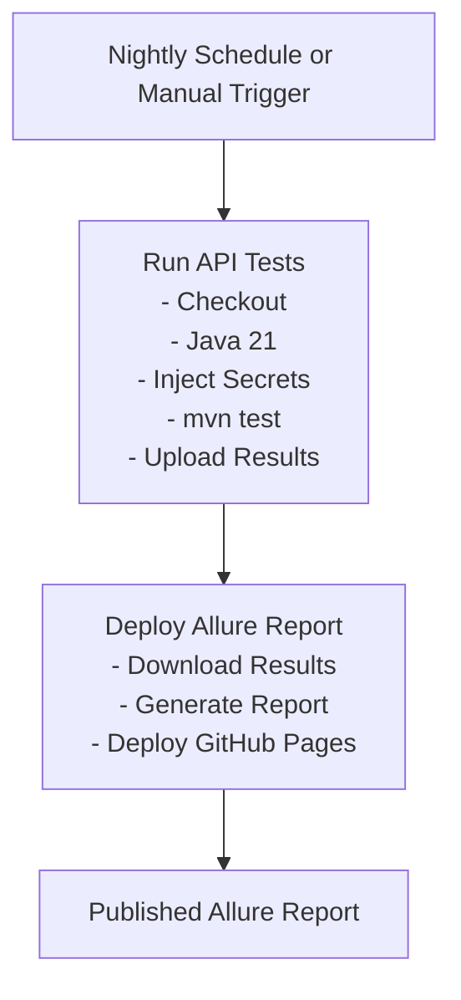

# Entity Structure Test Automation 

## What Does This Repository Do?

### The Simple Version

This is a **test automation project** that automatically checks whether
RBC's **Entity Structure** APIs behave correctly.

It:
1. Sends requests to the API.
2. Checks the responses.
3. Reports the results.

### What is "Entity Structure"?

The **Entity Structure** service manages relationships between financial
entities.

---

## The Big Picture -- Architecture Diagram

---

## Technology Stack Explained

### Core Languages & Build Tools

| Technology | Version | Purpose |
| --- | --- | --- |
| Java | 21 | Enterprise programming language |
| Maven | 3.x | Build & dependency management |

### Testing Framework

| Technology | Version | Purpose |
| --- | --- | --- |
| TestNG | 7.10.2 | Test runner |
| REST Assured | 5.4.0 | API testing |

### Reporting

| Technology | Version | Purpose |
| --- | --- | --- |
| Allure | 2.30.0 | HTML reports |

### Data Handling

| Technology | Version | Purpose |
| --- | --- | --- |
| Jackson | 2.18.6 | JSON processing |
| Lombok | 1.18.44 | Boilerplate reduction |
| JavaFaker | 1.0.2 | Fake data generation |
| Apache POI | 5.2.3 | Excel reader |

### Database

| Technology | Version | Purpose |
| --- | --- | --- |
| MongoDB Driver | 5.1.1 | Cosmos DB client |

### Infrastructure

- GitHub Actions
- GitHub Pages
- qTest

### Authentication

- Okta OAuth 2.0
- Corporate Proxy

---

## How Data Flows Through the System

### Test Execution Data Flow

---

## How Tests Run Automatically

---

## Summary -- The 60-Second Version

- Write Java automated tests.
- Authenticate with Okta.
- Call FCRU APIs.
- Validate responses.
- Publish Allure and qTest reports.
- Run nightly with GitHub Actions.

### Tech Stack

- Java 21
- Maven
- TestNG
- REST Assured
- Allure
- GitHub Actions

### API Under Test

- FCRU Entity Structure

### Database

- Cosmos DB (MongoDB compatible)

### Authentication

- Okta OAuth 2.0
