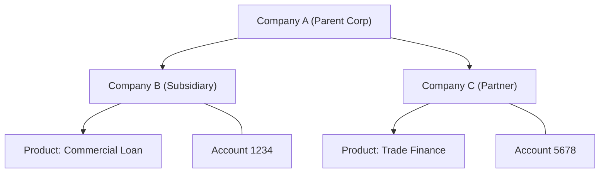
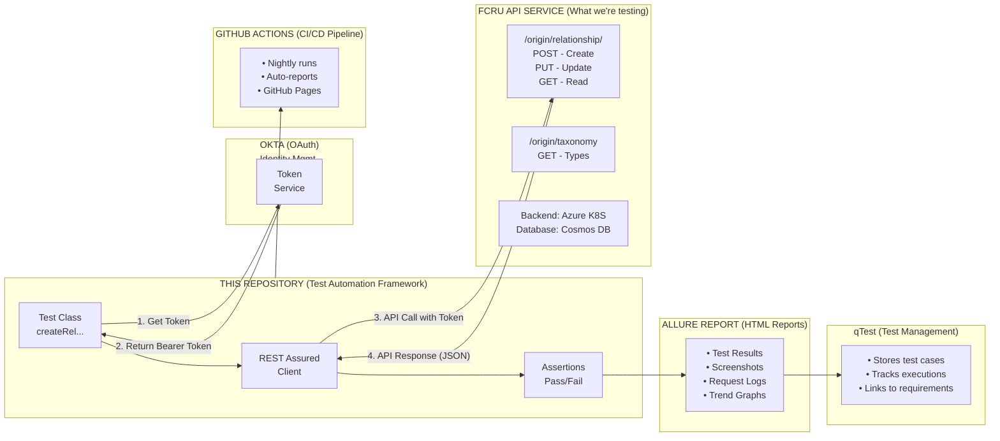
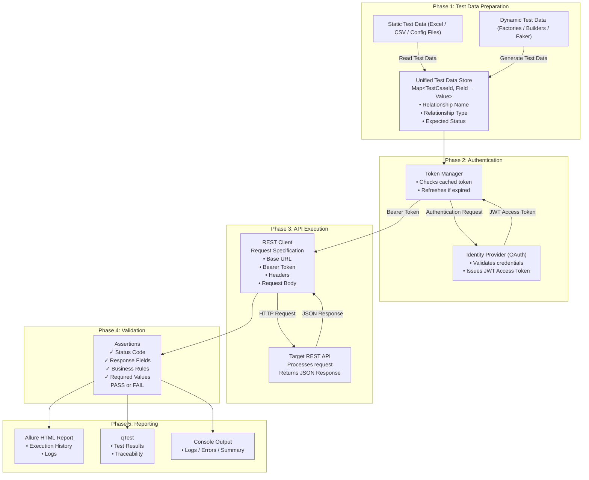

# CHU0 Entity Structure Test Automation — Complete Guide

---

## THE BIG PICTURE — What Does This Project Do?

Imagine you work at a bank (RBC). The bank has a computer system that manages relationships between different financial entities (like companies, people, accounts). This repository contains automated tests that verify this system works correctly.

**Think of it like this:** Instead of manually clicking buttons and checking if things work, we write code that automatically:
- Sends requests to the bank's API (like "Create a new relationship")
- Checks if the response is correct
- Reports success or failure

It does **not** build any features. It does **not** run any servers. It purely asks questions to APIs and checks the answers.

---

## What is "Entity Structure"?

The **Entity Structure** service manages relationships between financial entities.



---

## System Architecture



---

## The Three Tools It Uses

| Tool | What It Does | Real-World Analogy |
|---|---|---|
| **REST Assured** | Sends HTTP requests and reads responses | A smart Postman that runs in code |
| **TestNG** | Decides which tests run, in what order, and when setup/cleanup happens | A test manager who organises the schedule |
| **Allure** | Generates a readable HTML report of what passed and failed | The audit trail / test report that goes to stakeholders |

---

## Technology Stack

### Core Languages & Build Tools

| Technology | Version | Purpose |
|---|---|---|
| Java | 21 | Enterprise programming language |
| Maven | 3.x | Build & dependency management |

### Testing Framework

| Technology | Version | Purpose |
|---|---|---|
| TestNG | 7.10.2 | Test runner |
| REST Assured | 5.4.0 | API testing library |

### Reporting

| Technology | Version | Purpose |
|---|---|---|
| Allure | 2.30.0 | HTML test reports |

### Data Handling

| Technology | Version | Purpose |
|---|---|---|
| Jackson | 2.18.6 | JSON processing |
| Lombok | 1.18.44 | Boilerplate reduction (`@Builder`, `@Data`) |
| JavaFaker | 1.0.2 | Fake test data generation |
| Apache POI | 5.2.3 | Excel file reader |

### Database

| Technology | Version | Purpose |
|---|---|---|
| MongoDB Driver | 5.1.1 | Cosmos DB client |

### Infrastructure & Auth

- GitHub Actions (CI/CD nightly runs)
- GitHub Pages (report hosting)
- qTest (test case management)
- Okta OAuth 2.0 (machine-to-machine authentication)
- Corporate Proxy (Okta only; internal RBC hosts connect directly)

---

## The Folder Structure — What Lives Where

### Area 1 — The Infrastructure (`src/main/java`)

This is the **engine room**. It contains all the code that knows *how* to talk to each service — authentication, URLs, headers, request shapes. You never write test assertions here.

```
src/main/java/api/
├── FCRU/          → Entity structure service (the main relationship service)
├── Orchestration/ → The orchestration layer that combines multiple services
├── MRD/           → Master Reference Data (entity hierarchy data)
├── CLM/           → CLM entity service
├── Accounts/      → Account inquiry service
├── PIM/           → Product information / catalogue service
├── PRT0/          → Platform banking (DDA accounts, TD accounts, transactions)
└── utils/         → Shared base classes used by everything
```

### Area 2 — The Tests (`src/test/java`)

This is the **testing floor**. It contains all the test classes that use the infrastructure to make API calls and check results.

```
src/test/java/api/tests/
├── FCRU/          → 12 test files testing relationship management
├── Orchestration/ → 7 test files testing orchestration endpoints
└── PRT0/          → 3 test files testing platform banking APIs
```

---

## How Every Service Is Organised — The 5-Layer Pattern

Every single service in this project follows the same internal structure. Using FCRU as the example:

```
api/FCRU/
├── clients/       → The person who makes the phone call
├── specs/         → The script they follow before calling
├── data/
│   ├── endpoints/ → The phone number to call
│   └── factory/   → The prepared talking points (test data)
├── enums/         → The approved vocabulary (no improvising words)
└── models/        → The form/document being discussed on the call
```

### In Plain English, Each Layer Is:

**`endpoints/`** — *The Phone Book*
Stores every API URL path as a named constant. Instead of typing `/origin/relationship` everywhere, you use `FCRUEndpoints.CREATE_RELATIONSHIP`. The actual server address is read from a config file, not written in code.

**`specs/`** — *The Standard Letter Template*
Before sending any request, you need to attach an auth token, set the right headers, configure SSL, and tell the framework to log everything to the report. The Specifications class does all of this once. Every request to that service uses this same template automatically.

**`clients/`** — *The Clerk Who Sends the Letters*
One method per API call. The test says "send this transaction" and the client handles all the HTTP mechanics. Tests never deal with HTTP details directly.

**`models/`** — *The Form Being Filled In*
Java objects that represent what gets sent to the API (the request body) and what comes back (the response). Built with Lombok `@Builder` so they're easy to construct:
```java
Relationship.builder().name("Test123").status("DRAFT").build()
```

**`factory/`** — *The Test Data Generator*
Creates realistic but random test data using JavaFaker. For example, a relationship name becomes `RELAuto47392011` — always unique, always alphanumeric (no special characters that could cause encoding problems).

**`enums/`** — *The Approved Vocabulary List*
Domain-specific values like statuses and types are stored as named constants. You write `TaxonomyValues.PENDING_APPROVAL` instead of `"Pending Approval"`. If the value ever changes on the backend, you fix it in one file and every test updates automatically.

---

## The Inheritance Chain — "What You Get For Free"

Every test class inherits from a stack of base classes. Think of it like layers of a cake — each layer adds something, and the top layer (your test class) gets everything below it for free.

```
Layer 1 — baseTestNgGlobal          ← Global setup
  Provides: qTest result publishing, suite start/end hooks

Layer 2 — baseTestNg                ← TestNG lifecycle hooks
  Provides: Excel test data loading, request/response log saving, pass/fail count

Layer 3 — TestBaseApi               ← Configures REST Assured
  Provides: loading secret credentials from .env file, global HTTP configuration

Layer 4 — BaseTest                  ← Sets up all service clients (most tests live here)
  Provides: all service clients already created and ready to use

Layer 5 — BasePRT0Test              ← PRT0 tests specifically
  Provides: PRT0-specific clients (ddaClient, tdClient, txnPostingClient), Excel data

Your Test Class                     ← You write tests here (just the actual test logic)
```

Because `RestrictTDFundingByDOLTests` extends `BasePRT0Test`, it can call `txnPostingClient.postTransaction(payload)` directly in any test method — all the setup happened automatically in the layers above.

---

## File-by-File Explanation

### Authentication Layer

#### `OAuthTokenManager.java`

**What it does:** Gets security tokens from Okta (like a key to unlock the API).

**How it works:**
```java
// Before: No token, can't call API
String token = OAuthTokenManager.getOktaM2MAccessToken();
// After: You have a token valid for ~1 hour
```

**Smart features:**
- Caches the token (doesn't fetch every time)
- Auto-refreshes 5 minutes before expiry
- Thread-safe (multiple tests can share it)

**How secrets work:**
- Token URL: stored in `qat.api.properties` (not secret)
- Client ID: `0oabc1qp91Tp61oRs1d7` stored in `qat.api.properties` (not secret)
- Client Secret: read from environment variable `OKTA_CLIENT_SECRET` (**secret, never in files!**)

---

### Base Test Classes (The Foundation)

#### `TestBaseApi.java`

**What it does:** Configures REST Assured library settings globally.

**Key configurations:**
```java
@BeforeClass
public void configureRestAssured() {
    loadDotEnv();    // Load secrets from .env file
    // Configure JSON handling
    // Configure SSL
    // Configure logging
}
```

#### `BaseTest.java`

**What it does:** Creates all service clients so every test class can use them without any setup code.

Instantiates `RelationshipClient`, `MRDClient`, and all other service clients in a `@BeforeClass` method.

#### `BasePRT0Test.java`

**What it does:** Extends `BaseTest` with PRT0-specific clients and Excel data loading for the platform banking tests.

---

## Authentication — How Tokens Work Without You Thinking About It

Most services use Okta M2M (machine-to-machine) OAuth tokens. The flow is:

1. The framework has its own client identity (like a service account)
2. Before the first test runs, it fetches a token from Okta
3. That token is cached in memory and reused for all subsequent tests
4. It automatically refreshes the token 5 minutes before it expires
5. Every request gets `Authorization: Bearer <token>` in its header automatically

The secret (client secret) **never lives in any file**. It must come from an environment variable called `OKTA_CLIENT_SECRET`. Locally, you put it in a `.env` file in the project root. In CI (GitHub Actions), it comes from GitHub Secrets.

PRT0 uses a different auth system via its own `PRT0TokenManager` — same concept, different token endpoint.

---

## How Data Flows Through the System



---

## Complete Test Execution Flow

```
1. TestNG reads TestNG_EntityStructure.xml
   ↓
2. Finds CreateRelationshipTests.java
   ↓
3. TestNG calls @BeforeSuite in baseTestNg
   - Loads qTest configuration
   ↓
4. TestNG calls @BeforeClass in TestBaseApi
   - Loads .env file
   - Configures RestAssured (JSON, SSL, logging)
   ↓
5. TestNG calls @BeforeClass in BaseTest
   - Creates RelationshipClient, MRDClient, etc.
   ↓
6. TestNG calls @Test method: createRelationshipApiForMandatoryFields()
   ↓
7. Test creates data via RelationshipFactory
   - JavaFaker generates "RELAuto12345678"
   - Builder creates Relationship object
   ↓
8. Test calls API: relationshipClient.createRelationship(relationship)
   - Client uses FCRUSpecifications.baseFCRURequestSpecification()
   - OAuthTokenManager.getOktaM2MAccessToken() fetches token
   - REST Assured sends POST request with JSON body
   ↓
9. Server responds: {"relationshipId": "REL-123", "relationshipName": "RELAuto..."}
   - .spec(FCRUSpecifications.validResponseSpecification())
   ↓
10. Validation:
    - Checks status code is 200 or 201
    - Checks relationshipId starts with "REL-"
    - Checks all required fields present
```

---

## How One Test Actually Runs — Step by Step

Using TC-001 from `RestrictTDFundingByDOLTests` as the concrete example:

### 1. Setup happens (automatic)
Before your test even starts, several `@BeforeClass` methods fire in order:
- RestAssured is configured with SSL and JSON settings
- All service clients are created
- PRT0 config is loaded
- Excel test data for the "DOLTxnPosting" sheet is loaded into memory

### 2. Your test method starts
```java
txnPostingWithTDCreditAccountIsRejected()
```

### 3. Test data is built
`buildTxnPayload()` assembles a simple Java Map that looks like a transaction:
- Debit side: DDA account `100000000410` (starts with "1")
- Credit side: TD account `200000000001` (starts with "2" — this is what triggers the rule)

### 4. The HTTP call is made
`txnPostingClient.postTransaction(payload)` fires. Behind the scenes:
- `PRT0Specifications.baseRequestSpec()` builds the request with base URL, auth token, and headers
- REST Assured sends `POST /PRT0/online-trn-posting/v1/dda/transaction/posting`
- The response comes back as a `ValidatableResponse` object

### 5. Assertions run
The test checks: did the API reject this TD credit account as expected? It accepts either:
- A non-200 status code (400, 403, 422), OR
- A 200 with the word "declined" or "error" in the body

### 6. Cleanup happens (automatic)
- The full request and response are saved as `.txt` and `.html` files in `/target/test-results/`
- The result (PASS or FAIL) is posted back to qTest

---

## The TestNG XML File — The Master Run List

**File:** `src/test/resources/TestNG_EntityStructure.xml`

This file is the master list of which test classes actually run. It defines 3 groups (FCRU, Orchestration, PRT0) and lists every class:

```xml
<class name="api.tests.FCRU.CreateRelationshipTests"/>
<class name="api.tests.FCRU.TaxonomyTests"/>
...
<class name="api.tests.PRT0.DDAAccountActivationTests"/>
```

> **Critical:** `RestrictTDFundingByDOLTests` is written and works, but it is **not currently in this XML**. That means it will never run in CI until it is added here. This is the most commonly missed step.

---

## How to Add a New Service — The 9-Step Process

Imagine you need to add tests for a new service called `FraudCheck`.

### Step 1 — Tell the project where the server lives
Open `src/main/resources/qat.api.properties` and add:
```
FraudCheck.uri=https://fraud-check-svc-private-qat.westus2.aks.nonp.c1.rbc.com
```

### Step 2 — Create a config reader for that URL
Create `FraudCheckEndpointsConfig.java` — a simple Java interface that says "read the `FraudCheck.uri` key from the properties file". The framework handles the rest automatically.

### Step 3 — Create a constants file for API paths
Create `FraudCheckEndpoints.java`:
```java
public static final String SCREEN = "/fraud/v1/screen";
public static final String SCORE  = "/fraud/v1/score/{id}";
```
No test ever types a URL string directly again.

### Step 4 — Create the Specifications class
Create `FraudCheckSpecifications.java`. This class builds the "standard letter template" — base URL from the config, auth token from `OAuthTokenManager`, required headers, SSL, Allure logging filter. Also define response validators here.

### Step 5 — Create the Client class
Create `FraudCheckClient.java` with one method per API call:
```java
public ValidatableResponse screenTransaction(Object payload) { ... }
public ValidatableResponse getRiskScore(String id) { ... }
```
Tests call these methods. The HTTP mechanics are invisible to tests.

### Step 6 — Create Models and Enums
- **Models:** Java objects representing request/response payloads (use Lombok `@Builder`)
- **Enums:** Constants for domain values like `FraudDecision.APPROVED`, `FraudDecision.DECLINED`

### Step 7 — Register the client in BaseTest
Add `fraudCheckClient = new FraudCheckClient()` to the `setUp()` method in `BaseTest.java`. From this point on, every test class in the whole project has `fraudCheckClient` available automatically.

### Step 8 — Write the test class
Create `FraudCheckScreeningTests.java` in `src/test/java/api/tests/FraudCheck/`. Extend `BaseTest`. Use `fraudCheckClient` directly. Use `step()` lambdas for sub-step reporting in Allure.

### Step 9 — Register in the TestNG XML ⚠️ Never Skip This
Add to `TestNG_EntityStructure.xml`:
```xml
<class name="api.tests.FraudCheck.FraudCheckScreeningTests"/>
```
Without this line, the test will **never run in CI**. This is the most commonly missed step.

---

## The 5 Rules to Always Follow

| Rule | Why |
|---|---|
| All server URLs go in `.properties` files, never in Java code | Easy environment switching (QAT → UAT → Prod) |
| All HTTP calls go in Client classes, not in test methods | Tests stay readable; HTTP details are hidden |
| All request building goes in Specifications, not inline | Changing a header means changing one file |
| All domain strings go in Enums, never typed raw | If a value changes, fix it once, everything follows |
| All test classes must be listed in TestNG XML | CI won't find them otherwise |

---

## What's in AGENTS.md

The `AGENTS.md` file at the project root contains key context for anyone working in this repo:

- **Architecture overview** — The two service groups (FCRU / Orchestration) with their upstream dependencies, the proxy routing rule (corporate proxy for Okta only; internal RBC hosts connect directly), and the full `BaseTest` class inheritance chain.

- **Key commands** — All non-obvious Maven commands with the required `--settings settings.xml`, correct `-Dgroups` and `-DproxyServer` values for each service group, and local Allure report generation.

- **New test class checklist** — The 5 steps including the easy-to-forget registration in `TestNG_EntityStructure.xml` (tests not listed there silently won't run in CI).

- **Project-specific patterns:**
  - Where each service's client/spec/endpoint/factory/model/enum code lives
  - The `XxxSpecifications` pattern (all RestAssured specs belong there, never inline in tests)
  - `RelationshipFactory` naming rule (alphanumeric-only to avoid REST Assured URL-encoding issues)

---

## Summary — The 60-Second Version

This is a Java test automation project that:
- Authenticates with Okta
- Calls RBC's banking APIs (FCRU, Orchestration, PRT0, and others)
- Validates API responses
- Publishes Allure HTML reports and qTest results
- Runs nightly on GitHub Actions

### Tech Stack
- **Java 21** + **Maven** — language and build
- **TestNG** — test runner
- **REST Assured** — API calls
- **Allure** — HTML reports
- **Lombok** + **JavaFaker** — models and test data
- **Okta OAuth 2.0** — authentication

### APIs Under Test
- FCRU Entity Structure (relationships between financial entities)
- Orchestration (combined service layer)
- PRT0 Platform Banking (DDA/TD accounts, transactions)

### What You Now Understand
- 6-layer inheritance from global base → your test class
- OAuth M2M token caching with auto-refresh
- Centralized API clients (not inline REST Assured)
- Reusable request/response spec validators
- Test data generators with JavaFaker
- POJOs representing JSON request/response structures
- All URLs in endpoint constants — never hardcoded
- Domain enums — never hardcode status/type strings
- 4-hour MRD file cache to speed up tests
- Suite → Class → Test execution lifecycle
- Properties files + env vars for secrets
- Allure HTML + qTest integration for reporting
