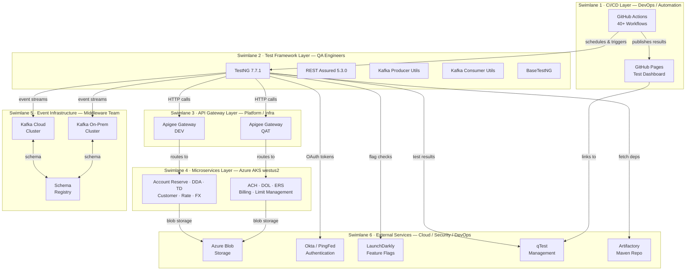
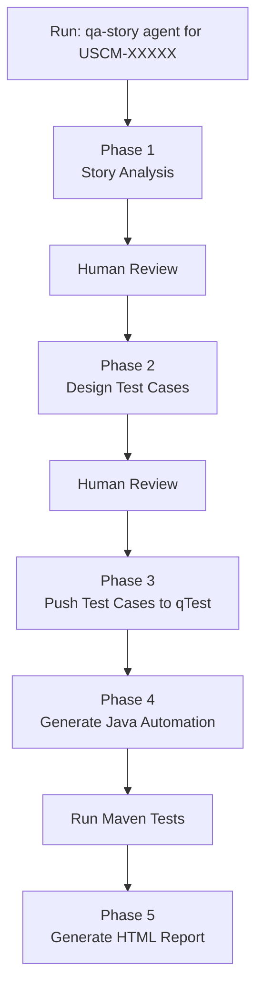

# QA Automation & PRT0 Functional Regression Guide(API testing /middelware)

## Framework Overview

The **PRTO Functional Regression Testing Framework** is a Maven-based Java test automation suite designed to validate the Core Banking Middleware platform — microservices deployed on Azure Kubernetes Service (AKS) in the westus2 region, covering REST API testing, Apache Kafka event-driven messaging validation, and end-to-end banking workflow verification.

The framework is built on TestNG 7.7.1 with REST Assured 5.3.0 for HTTP API testing and Apache Kafka Client 3.9.1 for asynchronous event stream validation. Over 40 GitHub Actions workflows orchestrate scheduled and on-demand test execution across DEV and QAT environments, with results published to a GitHub Pages dashboard for real-time visibility.

### Tool Stack

| Category | Technology |
| --- | --- |
| Language | Java 8 / 9 |
| Build Tool | Apache Maven |
| Test Framework | TestNG 7.7.1 |
| API Testing | REST Assured 5.3.0 |
| Messaging | Apache Kafka 3.9.1 |
| CI/CD | GitHub Actions (40+ workflows) |
| Target Environments | DEV , QAT  |
| Infrastructure | Azure AKS (westus2), Apigee API Gateway |

---

## Architecture — Swimlane Diagram



---

# End-to-End Automation Flow



## Phase 1 -- Story Analysis

-   Fetch Jira story
-   Read title, description, ACs, subtasks and comments
-   Verify Swagger endpoints exist
-   Detect gaps:
    -   Missing acceptance criteria
    -   Unclear fields
    -   Unknown error codes
-   Save: `context/qa/USCM-XXXXX/story-analysis.md`

## Phase 2 -- Test Case Design

-   Map every AC to one or more test cases
-   Include:
    -   Happy path
    -   Negative tests
    -   Edge cases
-   Generate Action → Expected Result table
-   Save: `context/qa/USCM-XXXXX/USCM-XXXXX-e2e-test-cases.md`

## Phase 3 -- Push to qTest

-   Create Sprint folder if missing
-   Create Story folder
-   Upload test cases
-   Link Jira requirement
-   Receive qTest IDs

## Phase 4 -- Generate Java Automation

Creates:

`src/test/java/api/tests/FCRU/YourNewTest.java`

Also: - Adds `@QTestCase` - Registers class in
`TestNG_EntityStructure.xml` - Adds missing factories/endpoints if
needed

Run:

``` bash
./mvnw test -Dtest=YourNewTest -Denv=qat
```

## Phase 5 -- Reporting

``` bash
./mvnw allure:serve
```

Produces: - Visual HTML report - HTTP requests/responses - Step
breakdown - Results pushed back to qTest

------------------------------------------------------------------------

# Repository Comparison

  -----------------------------------------------------------------------------
  Item         chu0-EntityStructure                          PRT0
  ------------ --------------------------------------------- ------------------
  Purpose      Entity Structure regression                   Platform/Product
                                                             banking APIs

  Scale        Single service                                60+ APIs across
                                                             25+ domains

  Test classes 19                                            60+

  Data         Factory generated                             File driven

  Transport    REST                                          REST + Kafka

  Auth         Okta OAuth                                    OAuth + Kerberos +
                                                             Kafka

  Coverage     Deep                                          Broad
  -----------------------------------------------------------------------------

## Test Data

### chu0

-   RelationshipFactory.java
-   Java builders
-   Randomized generated data

### PRT0

-   Excel
-   CSV
-   JSON payloads
-   DataProviders

------------------------------------------------------------------------

# Authentication Comparison

  chu0               PRT0
  ------------------ -------------------
  Okta OAuth         OAuthTokenManager
  REST only          REST + Kafka
  No Kafka auth      JAAS + Kerberos
  No feature flags   LaunchDarkly

------------------------------------------------------------------------

# What PRT0 Adds

-   Kafka testing
-   Database verification
-   CSV reader utilities
-   HTML dashboard
-   JSON schema validation
-   Centralized error messages
-   Feature toggles
-   AI prompt markdown files
-   Multi-environment Excel datasets

------------------------------------------------------------------------

# Architectural Differences

  chu0                    PRT0
  ----------------------- ------------------------------
  Code-generated data     File-driven data
  REST only               REST + Kafka
  OAuth only              OAuth + Kerberos
  Per-service structure   Domain-based utilities
  Retry logic             Not emphasized
  Story traceability      Broader regression framework

------------------------------------------------------------------------

# Migration Blockers

## Blocker 1

Different authentication systems.

Decision: - Reuse chu0 auth? - Keep separate auth?

## Blocker 2

Different base test hierarchy.

Decision: - Rewrite inheritance - Keep independent base classes

------------------------------------------------------------------------

# Migration Problems

1.  Java 8 vs Java 21 compatibility
2.  Package namespace changes
3.  Different authentication implementations
4.  Missing Allure annotations
5.  Legacy utilities outside Maven layout
